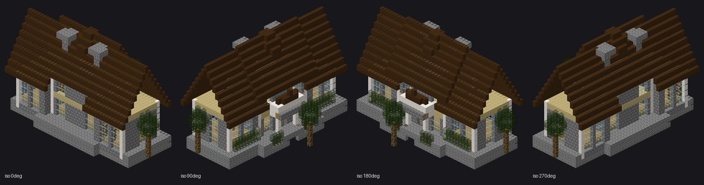
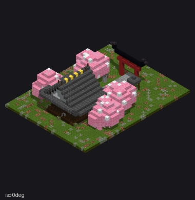
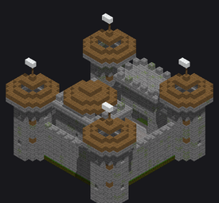
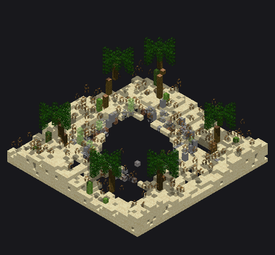
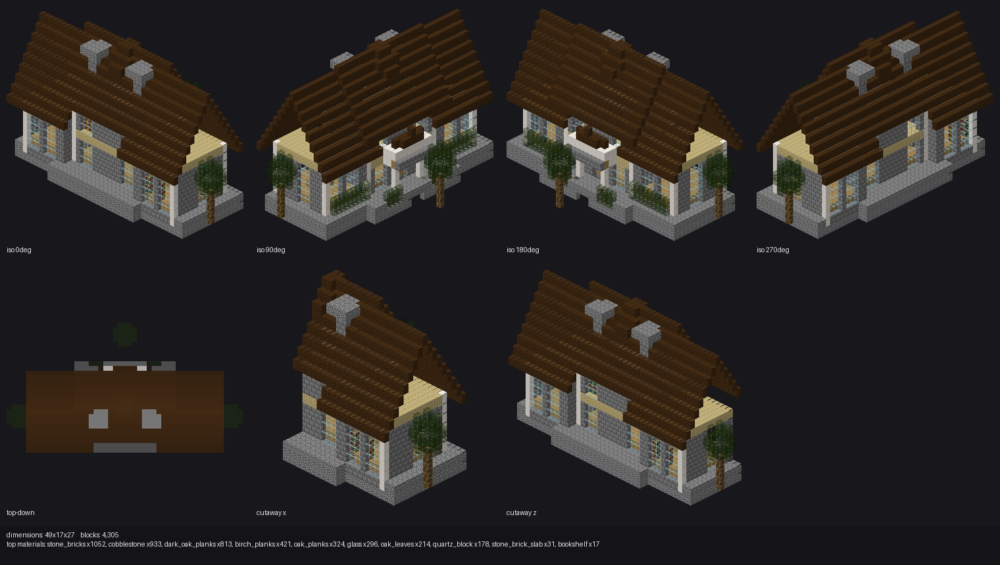

# mcbuild

**Turn a sentence into a Minecraft build.** A from-scratch LLM agent that writes
a blueprint program in a sandboxed Python DSL, interprets it into voxel data,
renders labeled multi-view screenshots with a pure-software isometric renderer,
and lets a vision-capable LLM critique its own renders and iterate via tool
calls — until it produces a WorldEdit-ready `.schem` file.


[](LICENSE)



*Four rotations of a mansion built end-to-end from the prompt `"make a mansion"` —
one of the agent's own self-critique renders, unedited.*

## How it works

```
prompt ──▶ LLM writes a blueprint (sandboxed Python DSL)
             │
             ▼
        DSL interpreter ──▶ sparse voxel grid
             │
             ▼
     isometric renderer ──▶ labeled multi-view PNG (4 rotations + top-down + cutaways)
             │
             ▼
   vision LLM critiques the render, calls a tool to edit/query/finish
             │
             └──── loop until finish() ────▶ WorldEdit .schem + full run directory
```

## Examples

Unedited iso-view renders from the agent's own run directories under `runs/`:

<table>
<tr>
<td align="center" width="33%">
<br>
<sub><code>"a traditional japanese shrine with a torii gate"</code></sub>
</td>
<td align="center" width="33%">
<br>
<sub><code>"a medival castle"</code></sub>
</td>
<td align="center" width="33%">
<br>
<sub><code>"a small lake in a desert"</code></sub>
</td>
</tr>
</table>

## Install

```bash
uv sync --extra dev
```

Set your OpenRouter key:

```bash
cp .env.example .env
# edit .env and set OPENROUTER_API_KEY=...
```

## Usage

```bash
uv run mcbuild "a medieval watchtower with interior spiral stairs"
```

<details>
<summary><strong>All options</strong></summary>

```
mcbuild PROMPT
  --model TEXT                 Vision-capable OpenRouter model id [default: anthropic/claude-sonnet-5]
  --max-iters INTEGER          [default: 6]
  --seed INTEGER                [default: 0]
  --display TEXT                auto|sixel|ansi|off  [default: auto]
  --out TEXT                    Run directory base  [default: runs]
  --reference/--no-reference    Generate a concept-reference image first  [default: no-reference]
  --ref-model TEXT              [default: openai/gpt-image-2]
  --reasoning TEXT              off|low|medium|high  [default: medium]
  --stream/--no-stream          Stream reasoning/completion text live  [default: stream]
  --cost-ceiling FLOAT          Abort (keeping the best build so far) once usage cost reaches this many USD
```

`--display auto` probes the terminal for sixel support (via a DA1 query) and
falls back to ANSI half-block rendering (`rich-pixels`) if unavailable.

</details>

Each run writes to `runs/<timestamp>-<slug>/`:

```
prompt.txt
reference.png          (if --reference)
iter_NN/blueprint.py
iter_NN/render.png
iter_NN/stats.json
final.schem
final_blueprint.py
session.json            (full message log, for debugging)
```

### Offline demo (no API key / no network)

```bash
uv run mcbuild "a tiny stone hut" --fake-llm --max-iters 3
```

Runs the full pipeline against a scripted stand-in LLM (broken blueprint ->
line-mapped error -> fixed blueprint -> render -> finish) so you can see the
whole loop and artifact layout without hitting the network.

## The blueprint DSL

Blueprints are sandboxed Python — no imports, no `_`-prefixed attribute access,
no dangerous builtins, and a line-count + wall-clock execution budget. See
[`src/mcbuild/dsl/REFERENCE.md`](src/mcbuild/dsl/REFERENCE.md) for the full
primitive/transform reference and worked examples.

## Capabilities

- **Incremental editing**: `submit_blueprint` (full rebuild), `str_replace` (find/replace against
  the accumulated blueprint source, then rerun it whole), `edit_region` (rebuild one bounding box,
  freeze the rest).
- **Bulk + detail primitives**: `set_blocks`, `weighted_block`, `scatter`, `frame`, `window_grid`.
- **`get_block(x, y, z)`**: reads back whatever the blueprint has placed at a cell so far (or
  `None`), so later code can react to earlier code — skip already-weathered cells, check a
  neighbor before placing trim, etc.
- **Block states**: `"oak_stairs[facing=north,half=top]"` etc. render with true geometry (stairs,
  slabs, walls, fences, fence gates, trapdoors, doors, panes) and export with the state suffix.
- **Free 3D camera** for `inspect` (arbitrary position + look-at, orthographic z-buffer), plus
  arbitrary/y-axis slices and a lossless text `query` tool (ASCII floor plans, point lookups,
  material histograms).
- **`'air'`** is placeable — carves/erases and is exported as `minecraft:air`.

Every iteration's self-critique render is a full contact sheet — four isometric
rotations, a top-down view, and two axis cutaways, with dimensions/block-count/
top-materials stats burned into the image:



## Project layout

```
src/mcbuild/
  cli.py             typer CLI, rich progress feed, sixel/ANSI display
  config.py          run configuration
  voxel.py           sparse VoxelGrid
  palette.py         curated block palette + fuzzy suggestions
  rundir.py          runs/<timestamp>-<slug>/ artifact management
  dsl/                sandbox, stdlib primitives, errors, REFERENCE.md
  render/             mesh rasterizer + free camera, iso contact sheet, sixel encoder,
                      block geometry (blockmodel/blockstate), textures
  llm/                OpenRouter client, scripted offline FakeLLM
  agent/              orchestration loop, prompts, tool schemas, text query views
  export/             Sponge Schematic v3 (.schem) export
```

## Development

```bash
uv run pytest
```

Tests cover: sandbox security (imports/dunders/budget), DSL shape primitives,
palette lookup + suggestions, isometric renderer output, sixel encoding,
Sponge Schematic v2 round-trip via `nbtlib`, and an offline agent-loop
integration test (scripted LLM: error -> fix -> finish) via the CLI's
`--fake-llm` path.

## Notes / limitations

- Accurate geometry covers the core architectural shape families; other stateful blocks fall
  back to full cubes, and blocks with no resolvable texture (e.g. `air`, `barrier`) don't render.
- Block geometry is paired from bundled vanilla blockstate JSON + hardcoded shape templates
  (the vanilla model JSONs are not shipped); silhouettes are correct, not pixel-exact-vanilla.
- No cross-run memory / few-shot retrieval of past builds.
- No RCON live placement; output is a `.schem` file for WorldEdit's `//schem load` + `//paste`.

## Future work (backlog)

- A structured plan/component-registry tool and gating `finish()` on a verification checklist.
- Iteration diffs (blocks added/removed vs. the previous iteration) and richer stats
  (per-storey counts, interior air volume, mirror-symmetry score).

## Acknowledgments

This project was inspired by [*APT: Architectural Planning and Text-to-Blueprint
Construction Using Large Language Models for Open-World Agents*](https://arxiv.org/pdf/2411.17255)
(Chen & Gao, 2024), which explores LLM-driven blueprint construction for
Minecraft agents. mcbuild is an independent, from-scratch implementation and
is not affiliated with or derived from that paper's code.

## AI disclosure

This project was built with significant AI assistance (Claude): most of the
codebase, this README, and much of the iterative design work were written or
co-written by an LLM agent under human direction and review. The renders
throughout this README are unedited output from the agent described above,
not hand-picked or touched-up examples.

## License

[MIT](LICENSE), except for the bundled Minecraft block textures/blockstates —
see [`src/mcbuild/assets/NOTICE.md`](src/mcbuild/assets/NOTICE.md). Minecraft
is a trademark of Mojang Studios / Microsoft; this project is not affiliated
with or endorsed by them.
